Twitter_real_or_not
==============================

How to detect disasters using twitter tweets?

Project Organization
------------

    ├── LICENSE
    ├── README.md          <- The top-level README for developers using this project.
    │
    ├── docs               <- A default Sphinx project; see sphinx-doc.org for details
    │
    ├── models             <- Trained and serialized models, model predictions, or model summaries
    │
    ├── notebooks          <- Jupyter notebooks. Naming convention is a number (for ordering),
    │                         the creator's initials, and a short `-` delimited description, e.g.
    │                         `1.0-jqp-initial-data-exploration`.
    │
    ├── references         <- Data dictionaries, manuals, and all other explanatory materials.
    │
    ├── reports            <- Generated analysis as HTML, PDF, LaTeX, etc.
    │   └── figures        <- Generated graphics and figures to be used in reporting
    │
    │
    imported
    ├── src                <- Source code for use in this project.
    │   ├── __init__.py    <- Makes src a Python module
    │   │
    │   ├── data           <- Scripts to download or generate data
    │   │   └── make_dataset.py
    │   │
    │   ├── features       <- Scripts to turn raw data into features for modeling
    │   │   └── build_features.py
    │   │
    │   ├── models         <- Scripts to train models and then use trained models to make
    │   │   │                 predictions
    │   │   ├── predict_model.py
    │   │   └── train_model.py
    │   │
    │   └── visualization  <- Scripts to create exploratory and results oriented visualizations
    │       └── visualize.py

--------

<small>Project based on the <a target="_blank" href="https://drivendata.github.io/cookiecutter-data-science/">cookiecutter data science project template</a>. #cookiecutterdatascience</small>

## Table of contents
- Define Problem
    - How to detect disasters using twitter tweets?
    
- Discover Data
   - Exploratory Data Analysis(EDA)
   - Data Visualization
   
- Develop solutions
    - Establish a baseline
    - NLP Models
    - LSTM
    - Glove LSTM
    - Bert

- Deploy solution
   - Automate the pipeline
   - Deploy the solution to gcloud and firebase
   
- Web app [link](https://real-or-not.herokuapp.com/)

   
## Defining The Problem

### How can we identify the disasters through tweets?

<i>Twitter has become an important communication channel in times of emergency. The ubiquitousness of smartphones enables people to announce an emergency they’re observing in real-time. Because of this, more agencies are interested in programatically monitoring Twitter (i.e. disaster relief organizations and news agencies) 

But, it’s not always clear whether a person’s words are actually announcing a disaster. Through this project we want to solve this problem using some advanced technologies of NLP and accuratley classify between emergency and non-emergency tweets.</i>

## Discovering the Data

<b> Checking out the proportion of the data </b>

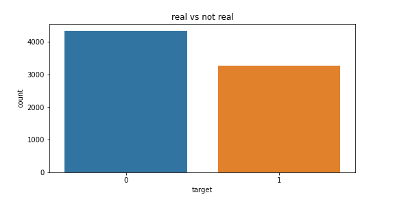

 
<i>It looks like we have slightly more non-disaster value compared to disaster value but 
there is no wide gap.</i> 

<b> Checking out the word count of the disaster and non-disaster </b>

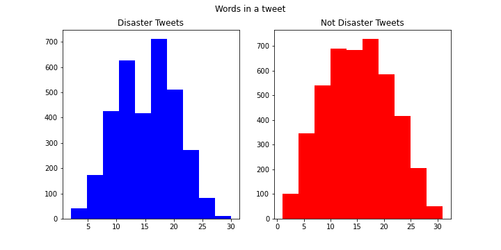

 
<i>We can see that overall not disaster tweets have more words 
compared to disaster tweets.</i> 

<b> Checking out the average word length </b> 
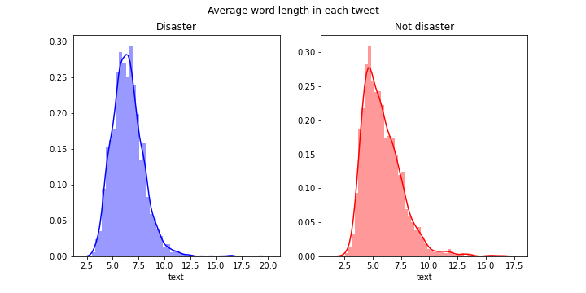
 
<i>The avg word length is very similar.</i> 

<b> Word Clouds </b>
|   |Disaster|Non-Disaster|
|---|------|--------------|
|Keyword|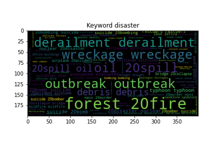|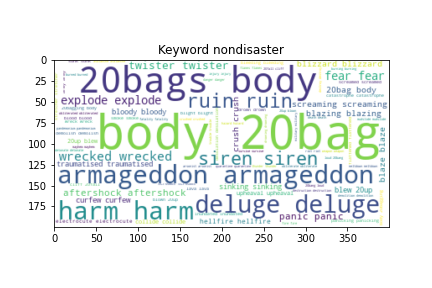|
|text|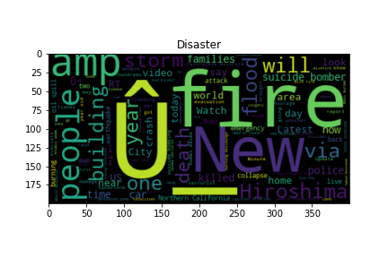|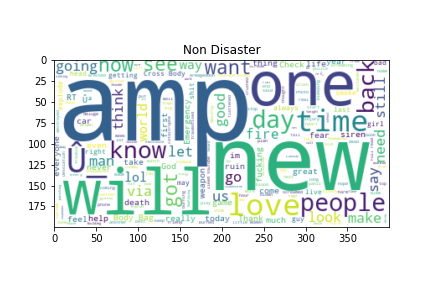|
 
<i>We can see that disaster tweets usally have <b>"Fire, Suicide bombing, car crash e.t.c"</b>  and non disaster has more words like <b>"love, people,good e.t.c "</b>
  
     
    We can see the keywords are a better indicator distinguishing between disaster and non disaster.</i>  
    
<b> Punctuation </b> 
|Disaster|Non-Disaster|
|---------|-----------|
|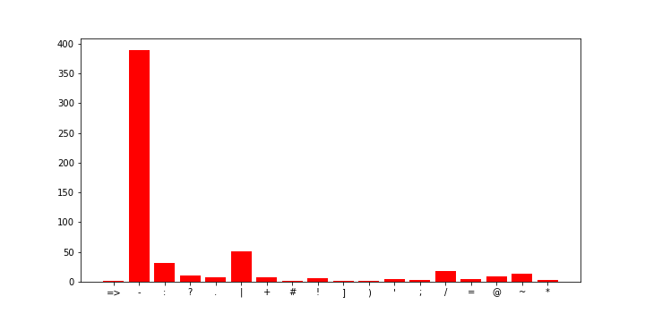|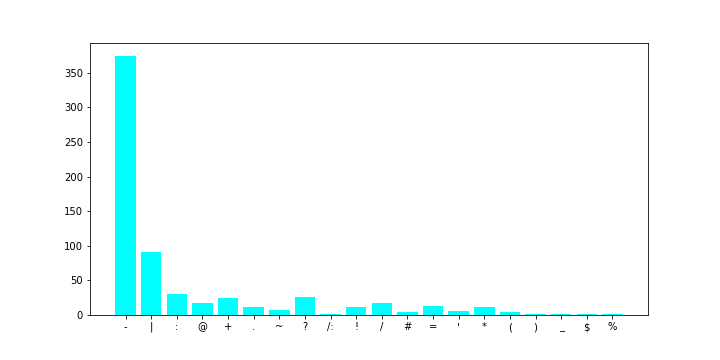|
  

### Developing Solutions

#### Establishing the Baseline
- <i> We used the most frequently apprearing key words as our baseline </i>
- <i> We achieved a 0.588 mean F-1 score and was placed at 1131 of 1273 teams in the kaggle competition. </i>  

#### 1. LSTM model

- <i> We used an LSTM model with word embedding and batch normalization </i>
- <i> We also used Early stopping call backs</i>  
<b> What is an LSTM Model?</b> 
<i> LSTM is an abbrevation for Long Short Term Memory(LSTM) what this means is that in our neural networks we have a <b>memory cell</b> that can store words that might play a key factor in determining what the output might be at the end of the sentence.</i>   
<b> What is an Word Embedding?</b> 
<i> A word embedding is a class of approaches for representing words and documents using a dense vector representation.
It is an improvement over more the traditional bag-of-word model encoding schemes where large sparse vectors were used to represent each word or to score each word within a vector to represent an entire vocabulary. These representations were sparse because the vocabularies were vast and a given word or document would be represented by a large vector comprised mostly of zero values</i>  
<b> What is batchnormalization?</b> 
<i>Batch normalization (also known as batch norm) is a method used to make artificial neural networks faster and more stable through normalization of the input layer by re-centering and re-scaling</i> 
<h5> Callbacks</h5>
<i> We used early stopping callbacks with a patience level of 10 so we do not overfit to our validation data</i>  

- <b> Results </b>
- <i> The LSTM submission resulted in a F1-Score of 0.76892 and was placed as 847 of 1273 teams which is a great improvment from baseline model.</i> 
- <b> Performance Graphs for 128, 64, 32 Dimensions </b>
- 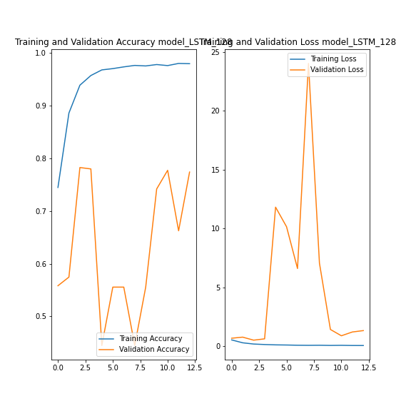
- 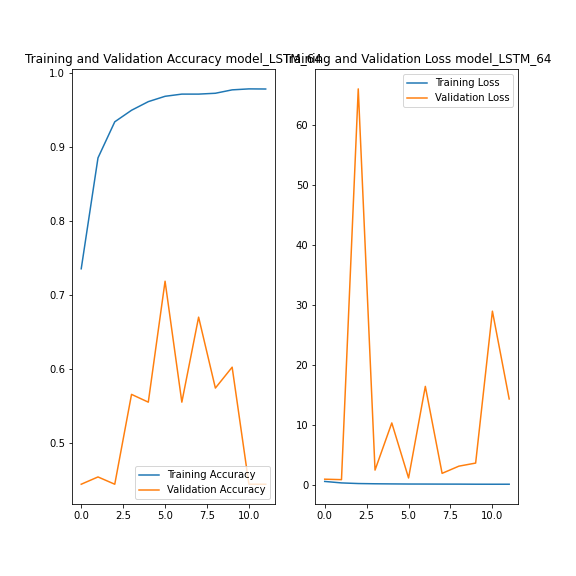
- 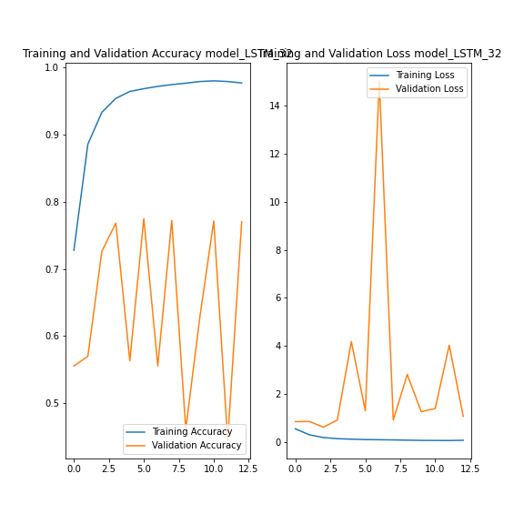

#### 2. Glove LSTM

- <i> After our first model we decided to enchance our model a little bit because we only have around 7000 tweets and this not a very big dataset for our model to learn the complex patterns.</i>
- <i> So we decide to help our model a little bit by use an unsupervised learning algorithm called Glove </i>
- <b> What is Glove?</b> 
<i>GloVe is an unsupervised learning algorithm for obtaining vector representations for words. Training is performed on aggregated global word-word co-occurrence statistics from a corpus, and the resulting representations showcase interesting linear substructures of the word vector space. </i> 
- <b> Results </b>
-  <i>The glove LSTM submission resulted in a F1-Score of 0.80171 and was placed 601 of 1273 which is an improvment from LSTM model.</i>
- <b> Performance Graphs for 300, 200, 100 Dimensions </b>
- 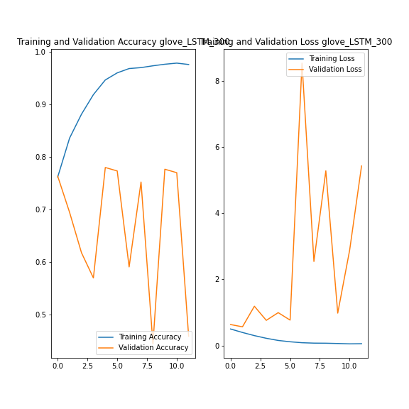
- 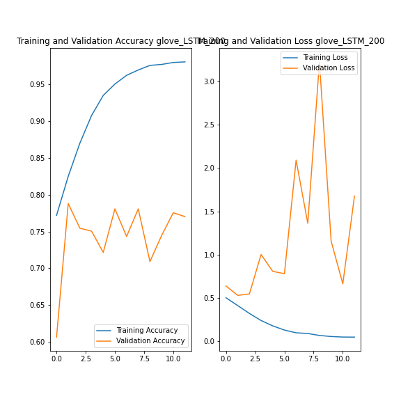
- 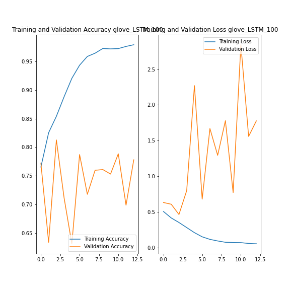

#### 3. Bert Model

- <b> Results </b>
- <i> We were able to achieve an 0.8271 F1-Score were placed in 336 of 1268 teams in the competition </i>

#### Deploying Solutions
 - We deployed our solution using Flask and Heroku
 - Here is the [link](https://real-or-not.herokuapp.com/)

