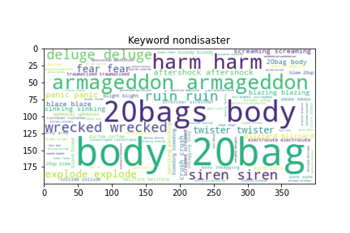
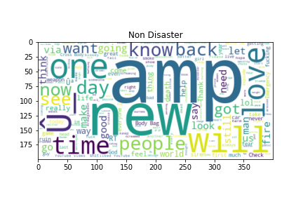

Twitter_real_or_not
==============================

How to detect disasters using twitter tweets?

Project Organization
------------

    ├── LICENSE
    ├── README.md          <- The top-level README for developers using this project.
    │
    ├── docs               <- A default Sphinx project; see sphinx-doc.org for details
    │
    ├── models             <- Trained and serialized models, model predictions, or model summaries
    │
    ├── notebooks          <- Jupyter notebooks. Naming convention is a number (for ordering),
    │                         the creator's initials, and a short `-` delimited description, e.g.
    │                         `1.0-jqp-initial-data-exploration`.
    │
    ├── references         <- Data dictionaries, manuals, and all other explanatory materials.
    │
    ├── reports            <- Generated analysis as HTML, PDF, LaTeX, etc.
    │   └── figures        <- Generated graphics and figures to be used in reporting
    │
    │
    imported
    ├── src                <- Source code for use in this project.
    │   ├── __init__.py    <- Makes src a Python module
    │   │
    │   ├── data           <- Scripts to download or generate data
    │   │   └── make_dataset.py
    │   │
    │   ├── features       <- Scripts to turn raw data into features for modeling
    │   │   └── build_features.py
    │   │
    │   ├── models         <- Scripts to train models and then use trained models to make
    │   │   │                 predictions
    │   │   ├── predict_model.py
    │   │   └── train_model.py
    │   │
    │   └── visualization  <- Scripts to create exploratory and results oriented visualizations
    │       └── visualize.py

--------

<small>Project based on the <a target="_blank" href="https://drivendata.github.io/cookiecutter-data-science/">cookiecutter data science project template</a>. #cookiecutterdatascience</small>

## Table of contents
- Define Problem
    - How to detect disasters using twitter tweets?
    
- Discover Data
   - Exploratory Data Analysis(EDA)
   - Data Visualization
   
- Develop solutions
    - Establish a baseline
    - NLP Models
    - LSTM
    - Glove LSTM
    - Bert

- Deploy solution
   - Automate the pipeline
   - Deploy the solution to gcloud and firebase
   
## Defining The Problem

### How can we identify the disasters through tweets?

<i>Twitter has become an important communication channel in times of emergency. The ubiquitousness of smartphones enables people to announce an emergency they’re observing in real-time. Because of this, more agencies are interested in programatically monitoring Twitter (i.e. disaster relief organizations and news agencies) 

But, it’s not always clear whether a person’s words are actually announcing a disaster. Through this project we want to solve this problem using some advanced technologies of NLP and accuratley classify between emergency and non-emergency tweets.</i>

## Discovering the Data

<b> Checking out the proportion of the data </b>

 
<i>It looks like we have slightly more non-disaster value compared to disaster value but 
there is no wide gap.</i> 

<b> Checking out the word count of the disaster and non-disaster </b>

 
<i>We can see that overall not disaster tweets have more words 
compared to disaster tweets.</i> 

<b> Checking out the average word length </b>

<i>The avg word length is very similar.</i> 

<b> Word Clouds </b>
|   |Disaster|Non-Disaster|
|---|------|--------------|
|Keyword|||
|text|||
 
<i>We can see that disaster tweets usally have <b>"Fire, Suicide bombing, car crash e.t.c"</b>  and non disaster has more words like <b>"love, people,good e.t.c "</b>
  
     
    We can see the keywords are a better indicator distinguishing between disaster and non disaster.</i> 
    
<b> Punctuation </b> 
|Disaster|Non-Disaster|
|---------|-----------|
|||
 

